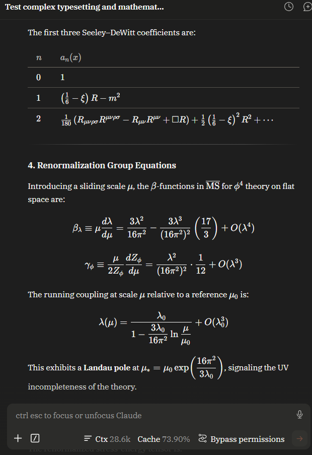
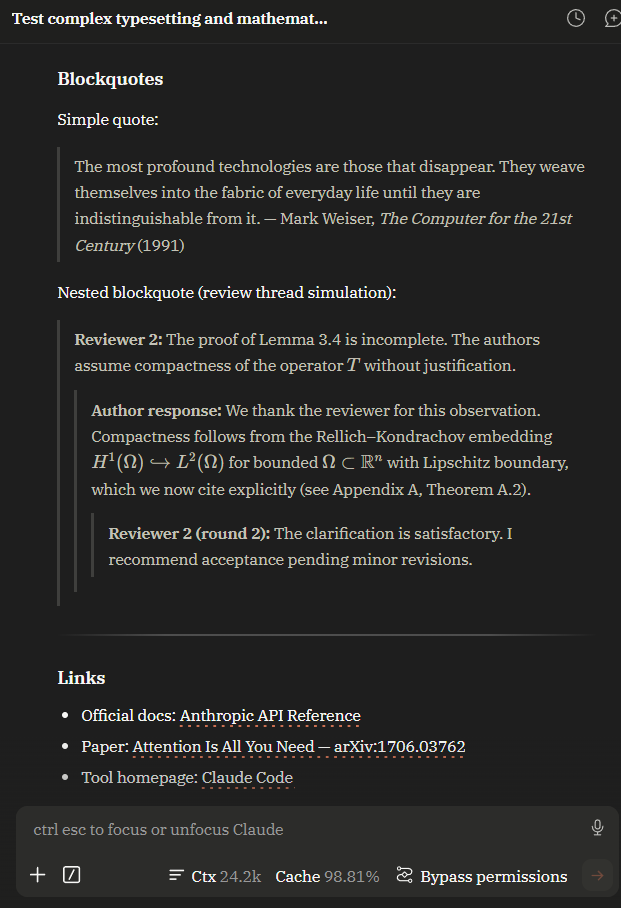
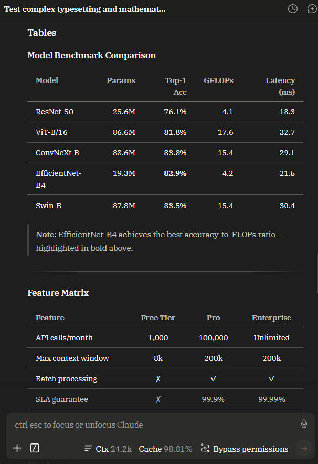
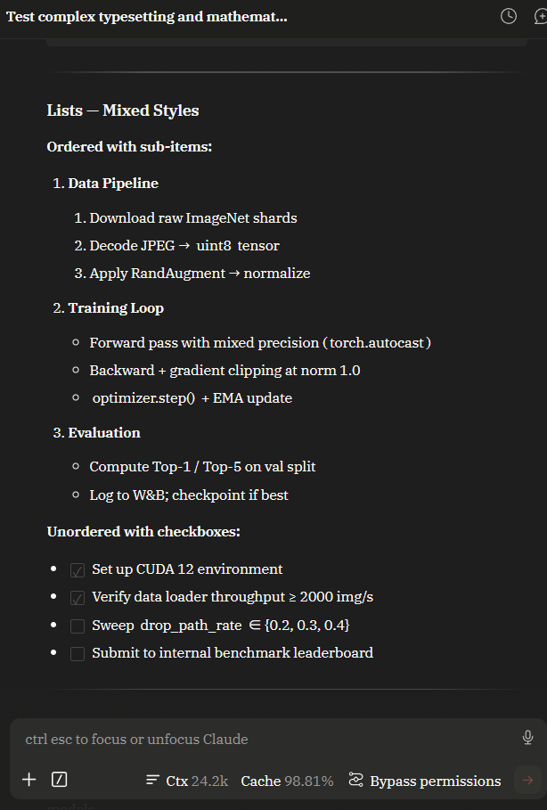
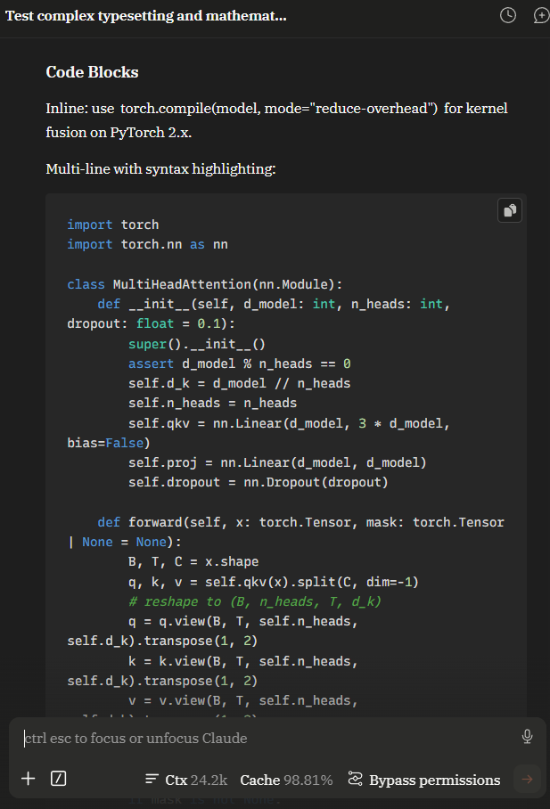
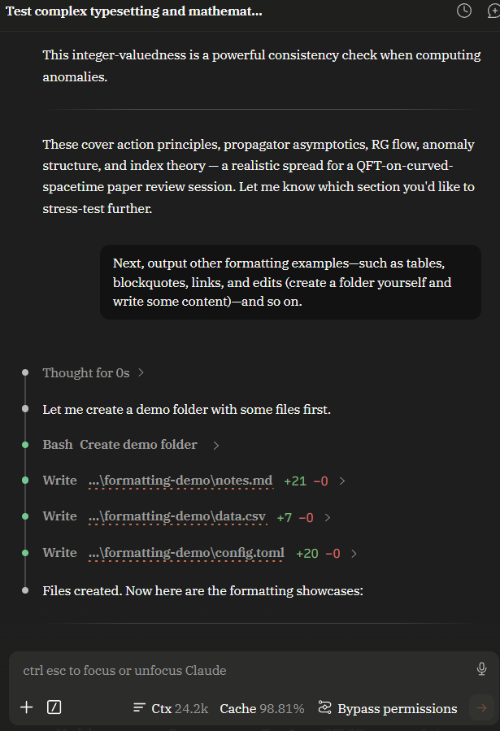

# incipit

*a quiet typesetting patch for long-form reading*

[中文版 →](README.zh.md)

---

The chat interface in VS Code's Claude Code extension is built for code conversations — wireframe UI elements, an engineering-grade sans-serif font, the occasional high-saturation warning indicator. As a programming tool, that's fine. But Claude's actual output goes well beyond code: mathematical derivations, long-form technical writing, mixed CJK-and-English academic discussion. That content doesn't read well inside a code-oriented interface, and math formulas are not rendered at all.

incipit turns this chat panel into a fully designed reading environment. It is a purely front-end transformation — no features are added, no network requests are modified. It makes Claude Code a place not just for writing code, but for sustained reading, study, and research. It's a local installer: run it once, reload VS Code, no extra dependencies, revertible at any time.

---

<p align="center">
  
  
</p>
<p align="center">
  
  
</p>
<p align="center">
  
  
</p>

---

## Install

Requires Node.js 16 or later.

```bash
npm install -g incipit
```

Then:

```bash
incipit
```

On first run you'll choose a language, then enter an interactive menu showing the current extension path, backup status, and options to apply or restore. Every apply is automatically backed up beforehand; for `settings.json` we only record the keys we modify, not the whole file, so your other VS Code settings cannot be accidentally overwritten on restore.

To skip the menu:

```bash
incipit apply     # apply directly
incipit restore   # restore directly
```

Note: incipit is not a rewritten Claude Code. It patches the rendering layer of your local installation, so when Claude Code itself updates, you'll need to run `incipit apply` again.

---

## What it does

incipit is a complete redesign of the chat interface, covering typography, rendering, interaction, and observability.

**Typography and visual design.** Body text switches to serif fonts (IBM Plex Serif for Latin, Noto Sans SC for CJK). Line height, paragraph spacing, and heading hierarchy are reset to proper typographic proportions. On Windows, font size and font parameters are specifically tuned to keep ClearType subpixel rendering in its sweet spot, so serif text stays sharp on screen rather than going fuzzy. The entire color scheme is redesigned around a warm dark palette with a single restrained accent color; the original interface's high-saturation warning elements are brought into a unified visual language.

**Math.** Claude's replies often contain mathematical content, but the stock interface does not render any of it — formulas appear as source code. incipit renders both inline and display math as typeset symbols. Rendering happens locally, with no network calls.

**Interaction fixes.** The stock Claude Code has a problem: thinking blocks you manually expand will all auto-open when new content streams in, causing the viewport to jump. incipit fixes this — only the thinking block you selected stays open. User message bubbles get a copy button, and long messages can be collapsed and expanded.

**Tool calls.** Every Claude Code response may contain tool calls — file reads, file edits, shell commands, code searches. The stock rendering is crude: Edit collapses to `Added X lines` with no visible diff, and other tools leave their full output occupying the viewport, so long conversations disappear under diff editors. incipit rewrites this layer. Edit / MultiEdit / Write calls are parsed from the underlying payload and shown with a precise `+N / -M` line count next to the filename; other tools keep the host's short summary as an identifier. Every tool call is collapsed by default, and the expand chevron uses the same animation as thinking blocks. Clicking anywhere on the row toggles the fold; the file path itself stays text-selectable.

**Context and cache monitoring.** A persistent badge sits at the bottom of the input box, showing current context size and cache hit rate. Click it to see per-turn breakdowns and cumulative session statistics. This data comes from Claude Code's local log files and involves no network requests.

**Command-line tool.** Running `incipit` without arguments opens an interactive menu showing the current extension path and backup status, navigated with arrow keys or j/k, space to toggle, enter to confirm. Both English and Chinese are supported (prompted on first run). The menu lets you toggle math rendering, the session usage badge, and tool-call folding, and switch the body font size (12/13/14). Each launch checks npm for a newer version (cached for 12 hours, skippable with `--no-update-check`) and offers to run the upgrade for you. `incipit apply` and `incipit restore` are non-interactive subcommands that emit no prompts, so they are safe to run in CI or scripts.

---

## Compliance

This is a purely front-end project. It does not touch the model tool-calling layer or the network request layer.

The provider's terms of service govern the relationship between you and their API: no abuse, no rate-limit circumvention, no identity spoofing, no interference with server-side protocols. incipit is entirely outside that scope — it only changes how things are rendered on your local screen, with no connection to the provider's servers. Every byte you send is identical before and after installation.

---

## Restore

```bash
incipit restore
```

This opens the restore menu. You'll see all available backups — pick one, confirm, and the modified files are written back to their backed-up state. Any other settings you've configured in VS Code are not affected.

Alternatively, right-click the Claude Code extension in VS Code and choose Reinstall Extension. The entire extension directory is rebuilt from the official package. Your backup directory `~/.incipit-backup/` is untouched; run `incipit` again whenever you want to reapply.

---

## Platforms

Fully tested and stable on Windows 11.

Linux and macOS should work in theory, but have not been verified on actual hardware. If you run into problems, open an issue with your Claude Code extension version and the error message.

---

## Why not a VS Code extension

VS Code enforces strict sandbox isolation between extensions — one extension cannot inject scripts or styles into another's webview. The only way to change how Claude Code's chat renders is to modify its local bundle files directly. That's why incipit takes the patching approach.

If Claude Code ever ships an official theming or style injection API, this project will migrate to that path immediately and the patching approach will be archived.

---

## Acknowledgements

Thanks to the [linuxdo](https://linux.do/) community for discussion, sharing, and feedback.

---

## License

MIT. See [LICENSE](LICENSE).

---

## Full feature list

Below is the complete set of user-visible changes incipit makes to the Claude Code chat interface, grouped by area.

**Reading & typography**

- Body text switches to serif fonts (IBM Plex Serif for Latin, Noto Sans SC for CJK), giving long-form reading a more natural rhythm
- Line height, paragraph spacing, and heading spacing reset to proper typographic proportions
- Heading hierarchy distinguished by weight and letter-spacing rather than size inflation; font sizes locked to integer pixels so serifs stay sharp on screen
- Message-level H1 is visually demoted to the H2 size, leaving the page-top conversation title as the only heading-level focus
- Color scheme redesigned as warm dark with a single restrained terracotta accent; the stock high-saturation warning elements are brought into a unified visual language
- Links adopt a scholarly footnote style: text in body color, with a terracotta radial-dot underline beneath
- User bubble, input box, and chat background form three naturally distinct layers instead of blending together
- On Windows, font size and font parameters are specifically tuned so ClearType subpixel rendering stays in its sweet spot
- Breathing space between CJK and Latin punctuation is generated automatically according to typographic rules
- The blue accent on the Effort slider and Thinking toggle is remapped to a warm camel tone consistent with the rest of the palette

**Math**

- Stock Claude Code does not render math at all; incipit typesets it in place as mathematical symbols
- Inline math `$...$` / `\(...\)` and display math `$$...$$` / `\[...\]` are all supported
- Bare `\begin{pmatrix}...\end{pmatrix}` (without any outer `$$` wrapping) — common in Claude's output — is also recognized
- 25 common LaTeX environments including align / cases / array / matrix / gather / multline are natively supported
- `\text{中文}` inside formulas automatically switches to the body font stack instead of falling back to a Latin glyph
- `\left(\underbrace{...}_{label}\right)` and similar labeled braces no longer balloon into oversized delimiters
- All rendering happens locally via KaTeX — not a single byte goes to any server

**Thinking blocks & user messages**

- Thinking blocks you manually expand stay open when new streamed content arrives, instead of being collapsed back
- Thinking blocks you did not expand are not force-opened by new content, so the viewport doesn't jump
- User message bubbles get a copy button
- Overly long user messages can be collapsed and expanded so they don't fill the viewport

**Tool calls**

- Tool calls are folded by default, so long conversations don't get buried under expanded diff editors
- Edit / MultiEdit / Write operations display precise `+N / -M` line counts
- Other tools (Bash / Read / Grep etc.) keep the host's short one-line summary as a fingerprint
- The expand chevron uses the same animation as the thinking toggle
- Deeply nested absolute paths are auto-truncated to `…\parent\filename`; hovering shows the full path
- Clicking anywhere on the row toggles fold; the path itself remains text-selectable

**Session usage monitoring**

- A persistent badge sits at the bottom of the input box, showing current context size and cache hit rate
- Click the badge to see per-turn breakdowns and cumulative session statistics
- Data comes entirely from Claude Code's local on-disk logs, with no network requests
- Compatible with non-Claude backends (Kimi / Deepseek / GLM etc.) — when no cache data is present, it shows `—` instead of a misleading `0.00%`
- Value changes run a scanning animation, making updates visually obvious

**Tables, blockquotes, lists, code**

- Tables adopt the Booktabs scholarly style, keeping only top / middle / bottom rules
- Blockquotes support multi-level nested visual hierarchy
- Ordered / unordered / checkbox lists all have their rhythm reset to match body breathing
- Code blocks use the monospaced Rec Mono Linear; multi-language syntax highlighting is bundled locally

**Command-line tool**

- Running `incipit` opens the interactive menu with full support for arrow keys, `j` / `k`, space, and enter; number shortcuts remain for backward compatibility
- On first launch, a language picker (Chinese / English) appears automatically — a one-time selection
- Three feature toggles inside the menu: math rendering / session usage badge / tool-call folding
- Body font size switchable between 12 / 13 / 14, with all other proportions following suit
- Each launch checks npm for a newer version (12-hour cache; can be disabled via environment variable or `--no-update-check`)
- Offers to run the npm upgrade command for you when a new version exists — no need to type it out
- `incipit apply` / `incipit restore` / `--help` are non-interactive subcommands safe to call from CI and scripts
- Each apply is automatically backed up; multiple named backups can be kept and restored selectively
- `settings.json` is tracked key-by-key rather than as a file blob, so your other VS Code configuration is never accidentally affected on restore
- The frontispiece and CLI layout are designed around book-like typographic rhythm, with a compact fallback for short terminals

**Fonts & system integration**

- Three font families are bundled entirely inside the extension: IBM Plex Serif (Latin serif), Noto Sans SC (CJK), and Rec Mono Linear (monospace); the chat interface uses our chosen fonts regardless of whether the system has them installed
- IBM Plex Serif is additionally installed to the user font directory (required by the VS Code input box's native font configuration, and usable by any other desktop app); the CJK and monospace fonts are already packaged inside the webview, so no system install is needed for them
- Windows writes to the HKCU font registry (no admin rights required); Linux runs `fc-cache` to refresh the font index; macOS recognizes the font automatically without a refresh

**Privacy & compliance**

- Pure frontend rendering changes — no code touches anything that communicates with the model provider's servers
- All assets (KaTeX / highlight.js / fonts / icons) are bundled locally — zero external network requests
- Every byte you send is identical before and after installing incipit
