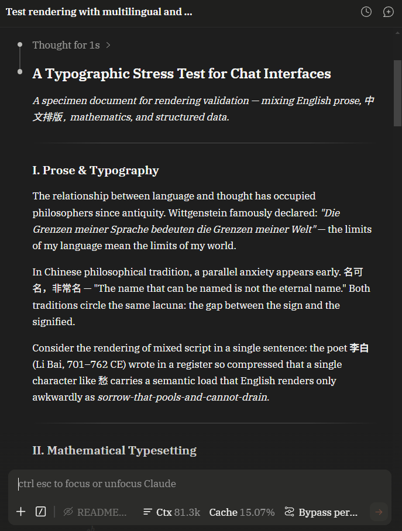

# incipit

*a quiet typesetting patch for long-form reading*

[中文版 →](README.zh.md)

---

The chat interface in VS Code's Claude Code extension is built for code conversations — wireframe UI elements, an engineering-grade sans-serif font, the occasional high-saturation warning indicator. As a programming tool, that's fine. But Claude's actual output goes well beyond code: mathematical derivations, long-form technical writing, mixed CJK-and-English academic discussion. That content doesn't read well inside a code-oriented interface, and math formulas are not rendered at all.

incipit turns this chat panel into a fully designed reading environment. It is a purely front-end transformation — no features are added, no network requests are modified. It makes Claude Code a place not just for writing code, but for sustained reading, study, and research. It's a local installer: run it once, reload VS Code, no extra dependencies, revertible at any time.

---

<p align="center">
  
  
</p>
<p align="center">
  
  
</p>
<p align="center">
  
</p>

---

## Install

Requires Node.js 16 or later.

```bash
npm install -g incipit
```

Then:

```bash
incipit
```

On first run you'll choose a language, then enter an interactive menu showing the current extension path, backup status, and options to apply or restore. Every apply is automatically backed up beforehand.

To skip the menu:

```bash
incipit apply     # apply directly
incipit restore   # restore directly
```

Note: incipit is not a rewritten Claude Code. It patches the rendering layer of your local installation, so when Claude Code itself updates, you'll need to run `incipit apply` again.

---

## What it does

incipit is a complete redesign of the chat interface, covering typography, rendering, interaction, and observability.

**Typography and visual design.** Body text switches to serif fonts (IBM Plex Serif for Latin, Noto Sans SC for CJK). Line height, paragraph spacing, and heading hierarchy are reset to proper typographic proportions. On Windows, font size and font parameters are specifically tuned to keep ClearType subpixel rendering in its sweet spot, so serif text stays sharp on screen rather than going fuzzy. The entire color scheme is redesigned around a warm dark palette with a single restrained accent color; the original interface's high-saturation warning elements are brought into a unified visual language.

**Math.** Claude's replies often contain mathematical content, but the stock interface does not render any of it — formulas appear as source code. incipit renders both inline and display math as typeset symbols. Rendering happens locally, with no network calls.

**Interaction fixes.** The stock Claude Code has a problem: thinking blocks you manually expand will all auto-open when new content streams in, causing the viewport to jump. incipit fixes this — only the thinking block you selected stays open. User message bubbles get a copy button, and long messages can be collapsed and expanded.

**Context and cache monitoring.** A persistent badge sits at the bottom of the input box, showing current context size and cache hit rate. Click it to see per-turn breakdowns and cumulative session statistics. This data comes from Claude Code's local log files and involves no network requests.

---

## Compliance

This is a purely front-end project. It does not touch the model tool-calling layer or the network request layer.

The provider's terms of service govern the relationship between you and their API: no abuse, no rate-limit circumvention, no identity spoofing, no interference with server-side protocols. incipit is entirely outside that scope — it only changes how things are rendered on your local screen, with no connection to the provider's servers. Every byte you send is identical before and after installation.

---

## Restore

```bash
incipit restore
```

This opens the restore menu. You'll see all available backups — pick one, confirm, and the modified files are written back to their backed-up state. Any other settings you've configured in VS Code are not affected.

Alternatively, right-click the Claude Code extension in VS Code and choose Reinstall Extension. The entire extension directory is rebuilt from the official package. Your backup directory `~/.incipit-backup/` is untouched; run `incipit` again whenever you want to reapply.

---

## Platforms

Fully tested and stable on Windows 11.

Linux and macOS should work in theory, but have not been verified on actual hardware. If you run into problems, open an issue with your Claude Code extension version and the error message.

---

## Why not a VS Code extension

VS Code enforces strict sandbox isolation between extensions — one extension cannot inject scripts or styles into another's webview. The only way to change how Claude Code's chat renders is to modify its local bundle files directly. That's why incipit takes the patching approach.

If Claude Code ever ships an official theming or style injection API, this project will migrate to that path immediately and the patching approach will be archived.

---

## License

MIT. See [LICENSE](LICENSE).
